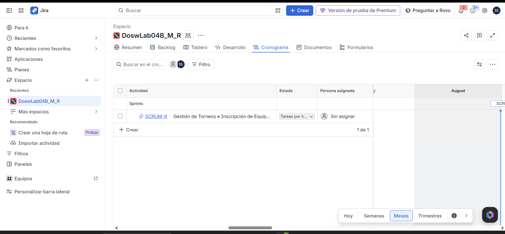
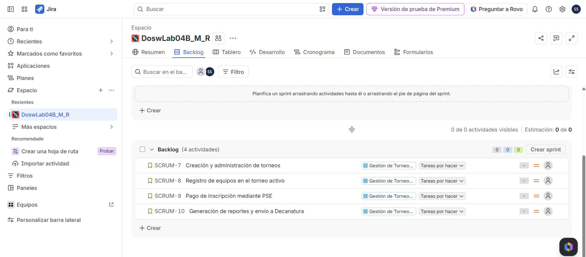
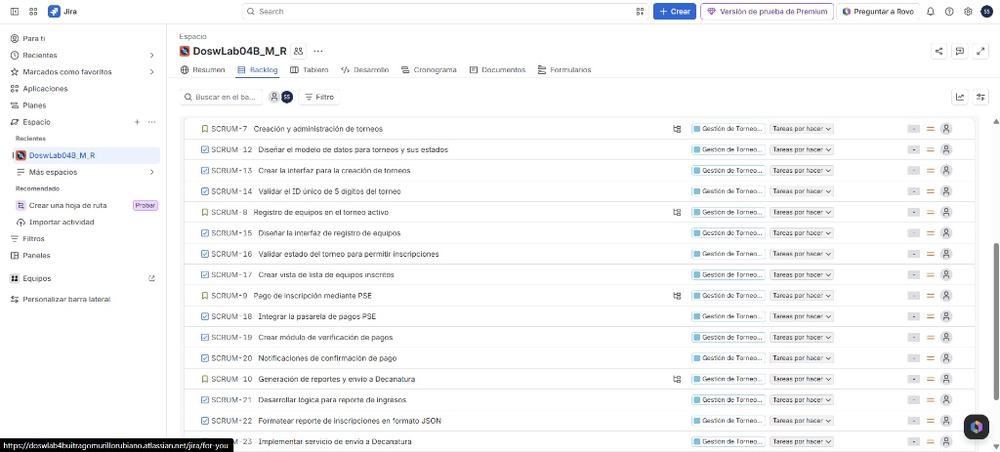
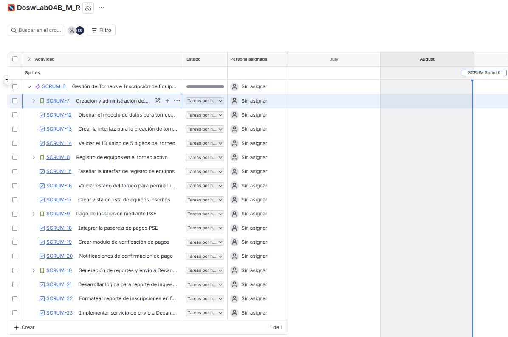
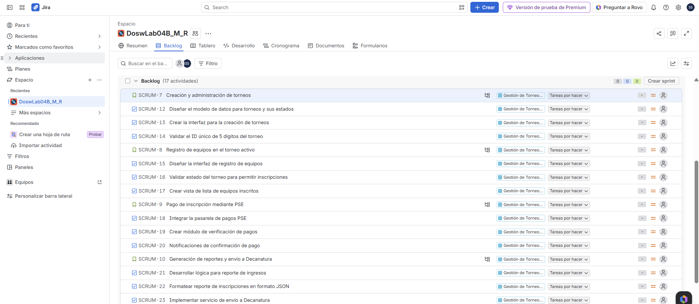

# Planeación del Sistema en Jira

## Desglose de trabajo: Épicas, Historias de Usuario y Tareas

La implementación de los requerimientos identificados de TechCup se desglosa de la siguiente manera:

### 1. Épica:
* **SCRUM-6:** Gestión de Torneos e Inscripción de Equipos

### 2. Historias de usuario:
* **SCRUM-7:** Creación y administración de torneos
* **SCRUM-8:** Registro de equipos en el torneo activo
* **SCRUM-9:** Pago de inscripción mediante PSE
* **SCRUM-10:** Generación de reportes y envío a Decanatura

### 3. Tareas:

### 4. Cronograma:

### 5. Backlog:
